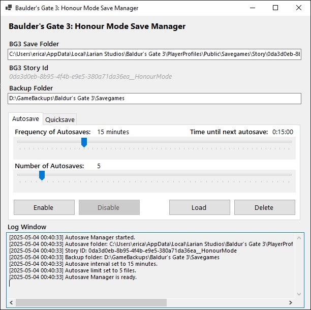

In an Honour Mode story you would use it as follows...

**Scenario:** Save scum prior to important dialog.

1. In Baulder's Gate 3 do a quicksave to create an autosave of HonourMode.lsv.
2. In my app open the Quicksave tab and then click on the Save button.
3. Back in BG3, assuming that the dialogue goes poorly, return back to the Main Menu.
4. Once in the Main Menu alt tab back to my app, open the Quicksave tab and click on the Load button.
5. By default the most recent quicksave will be listed, but you can select an older one if desired.
6. Click on the **Load Selected Backup** button.
7. Back in BG3, while still in the Main Menu, click Continue and your progress will be restored prior to when your dialogue went poorly.

It is that simple.

Other use cases include protective backups, such as enabling the autosave timer. This is really useful for users whom their game or computer frequently crash and run the risk of save corruption.
The list of use case scenarios is many, whether you are using it strictly as a backup, or as a save scum utility.
